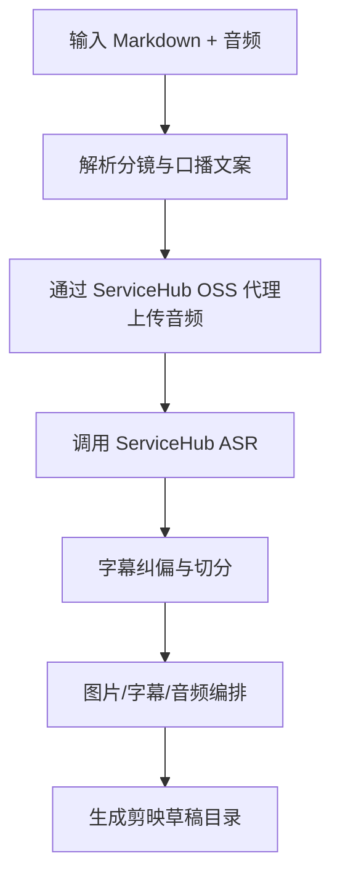

# skill-jianying-auto

`skill-jianying-auto` 用于把一篇包含分镜信息的 Markdown 文档和一段配音音频，自动处理为可直接在剪映打开的草稿目录。

## 主要功能

- 解析 `## 口播文案` 与 `## 口播文案分镜设计`
- 读取 Markdown 同级 `attachments/` 图片资源，并兼容 `Attachments/`
- 调用 ServiceHub ASR 获取字级时间戳
- 基于字幕、图片和音频生成剪映草稿
- 输出中间结果，便于排查对齐与编排问题
- 反向解析已有剪映草稿
- 基于参数 JSON 重新合成草稿
- 执行 roundtrip 校验与对齐质量评估

## 业务流程



## 目录结构

```text
skill-jianying-auto/
├─ SKILL.md
├─ README.md
├─ INSTALL.md
├─ .env.example
├─ .gitignore
├─ config.json
├─ requirements.txt
├─ aligner/
├─ references/
├─ scripts/
├─ user_data/
└─ utility/
```

## 获取与安装

1. 安装 Python 依赖：

```powershell
pip install -r requirements.txt
```

2. 按 `.env.example` 创建本地 `.env`，或在 `data/credentials.json` 中提供本地凭证。

3. 准备输入：
- 一篇本地 Markdown 文档
- 同级 `attachments/` 目录中的图片
- 一段配音音频

4. 执行总控脚本：

```powershell
python scripts/run_pipeline.py --md-path "E:/path/episode.md" --audio-path "E:/path/episode.mp3"
```

## 其他能力入口

```powershell
python scripts/parse.py --draft-folder "D:/JianyingPro Drafts/example" --output "E:/tmp/draft_para_collect.json"
python scripts/compose.py --input "E:/tmp/draft_para_collect.json"
python scripts/validate.py --input "E:/tmp/draft_para_collect.json" --draft-folder "D:/JianyingPro Drafts/example"
python scripts/roundtrip.py --draft-folder "D:/JianyingPro Drafts/example" --parsed-output "E:/tmp/roundtrip.json"
python scripts/evaluate_alignment.py --aligned-json "E:/tmp/aligned_asr.json" --ref-srt "E:/tmp/reference.srt"
```

## 凭证安全与隔离规范

- 不在仓库中写入真实凭证。
- 默认凭证优先级为：显式配置 > 环境变量 / `.env` > `data/credentials.json`。
- `.env`、`data/credentials.json`、运行产物与虚拟环境均应被 `.gitignore` 忽略。
- 本机敏感凭证说明仅允许引用：
  `E:\BaiduSyncdisk\WorkSpace\Personal\外部API与服务管理\API调用信息.md`

## 核心设计决策

- 保留 `config.json` 作为非敏感默认配置。
- 将敏感字段迁移为环境变量或本地凭证文件注入。
- 提供 `scripts/run_pipeline.py` 作为标准单入口，减少人工串联步骤。
- 保留源技能中的 `parse/compose/roundtrip/validate/evaluate_alignment` 能力，不裁剪辅助工具面。
- 保留 `output/asr_mid/` 中间文件用于对齐排障，不把它们纳入仓库版本管理。
